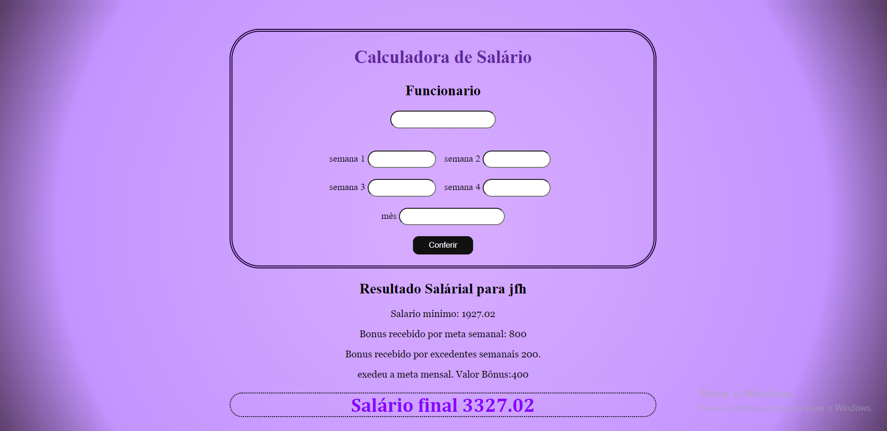
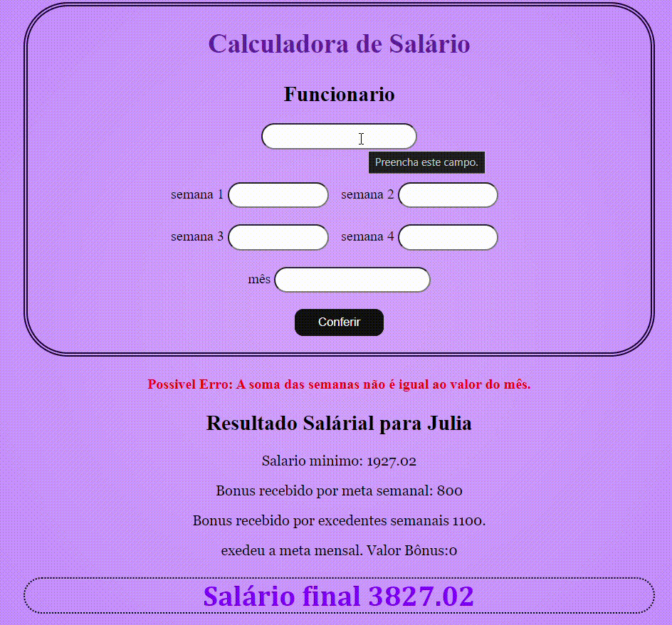
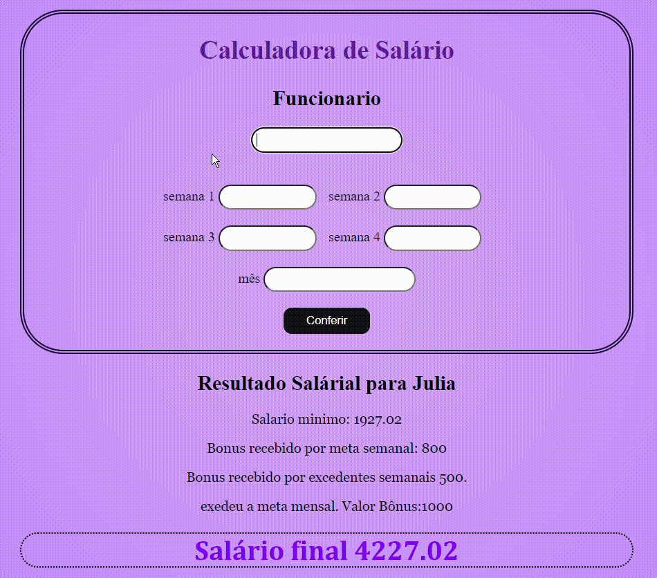

# 🔍 Atividades-Calculo de sálario

## 📋 descrição

- Desenvolvido para a matéria de `programação web II` no `Colégio Marista Irmão Acácio`, o arquivo tem a função de calcular a porcentagem de bônus que um funcionário ganha ao bater a meta semanal e mensal de uma empresa esse bônus é somado com um salário mínimo de 1927,02, o valor de meta semanal está estabecido como 20.000 e a cada batimento o funcionário ganha 1% sobre o valor e 5% sobre oque exceder esse valor e a meta mensal como 80.000(quatro vezes os 20.00 da semana) .
  Para o calculo foi utilizado um código em PHP, em HTML foi colocado as caixas de texto e com CSS a estilização como a cor de fundo, fonte e tamanho das letras e borda no em volda das caixas de texto

## 🖇️ Etapas:
Criei um repositório no github e comecei a programação do site usando HTML, adicionei caixas de texto onde dono da empresa irá colocar os valores obtidos pelos funcionários.   Usei o PHP para os cálculos do site, comecando com a porcentagem de cada bonus do valor vendido do funcionario,  exibindo os valores adquiridos e somando com o salario minimo.   Com o CSS fiz a estilização geral da página, modificando o plano de fundo, as fontes de letras ouve polimento das caixas de texto, deixando-as redondas, com o CSS também coloquei o botão interativo que pode calcular os dados que o usuário está buscando. 
Foi utilizado um [site](https://www.brasilcode.com.br/35-botoes-css-com-animacao/) Para a criação do botão.

### 🛠️ Tecnologias Utilizadas

- github
- HTML5
- PHP
- CSS

## 👀 Viaual do site

## Funcionando

-Nessa primeira demonstração os cálculos dão certo e mostra todos os detalhes das metas e por fim o salario total.

-Já nesse exemplo o valor dado no mês não corresponde ao valor dado nas semanas então aparece um alerta de erro para que o dono da empresa cheque de novo.

## ✒️ Autor

[ Emilly Caroline ](https://github.com/emillycaaroline)   

Segue aqui meu[linkedin](https://www.linkedin.com/in/emilly-caroline-129936290/recent-activity/all/)

